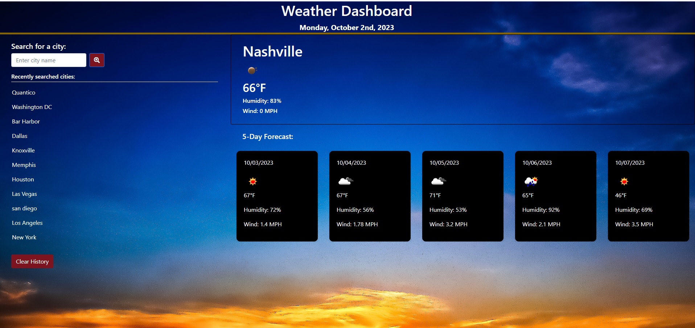

# 06 Server-Side APIs: Weather Dashboard

## My Mission

Create a weather dashboard using APIs. The website will give the weather for the users current location upon loading. When the user enters a city to search and submits that entry, the current weather for that location and the 5 day forecast will be displayed. The city will also be added to local storage and displayed in a list of previously searched cities. The previously searched cities can be clicked on and their data will load.

https://julieabowers.github.io/WeatherRepository/

